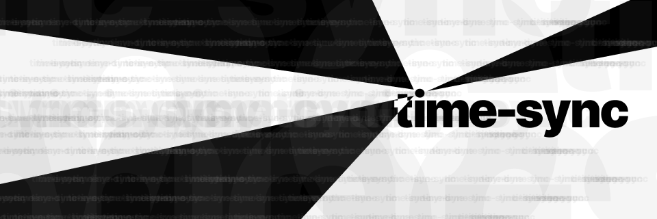

# time-sync

<!-- prettier-ignore-start -->
[](https://github.com/buenos-nachos/time-sync/blob/main/LICENSE) 
[](https://github.com/buenos-nachos/time-sync/actions/workflows/ci.yaml)
<!-- prettier-ignore-end -->



<sub>[(Link to Figma doc for banner image)](https://www.figma.com/design/Es6F3clZxP7GFZb4RJEbud/time-sync-banner?node-id=1-2)</sub>

`time-sync` is a set of packages designed to help avoid [screen tearing](https://github.com/reactwg/react-18/discussions/69) and snapshot test flakes when bringing time values into UIs. It centralizes time-based computations into a single place, and then forces you as a developer to be explicit about when and how processes can change over time. This makes sure that a user can't see different contradictory values on screen at the same time, but also provides the tools to make snapshot tests 100% deterministic.

While `time-sync` is designed for UIs first and foremost, the core package has zero runtime dependencies and can also be used for stateful servers (Node.js, Bun, Deno). More broadly, the core package provides the tools for ensuring processes can't ever get out of sync on a single device.

In other words, `time-sync` aims to make time more obvious, less magical, and easier to use in your codebases.

## Features

- 🔄 **Keep things in sync** – `time-sync` ensures that different systems on one device can't ever get out of sync with each other.
- 📸 **No more snapshot flakes** – `time-sync` makes it easy to freeze the date to a specific value to ensure that your snapshot tests stay deterministic. The upcoming UI framework bindings will have out-of-the-box support for platforms like Storybook.
- 📦 **As few dependencies as possible** – The vanilla version of `time-sync` has zero runtime dependencies. Each package for binding it to a framework aims to have the vanilla `time-sync` package and that framework as its only two dependencies.

### Coming soon

- 🖥️ **Bindings for popular UI frameworks** – `time-sync` will be launching bindings for React in the next few weeks. Solid.js bindings will launch soon after. Other frameworks may be added based on demand/interest.
- 🏝️ **Astro islands** – All the packages for binding `time-sync` to a UI framework aim to support Astro out of the box. This includes support for islands and the ability to mix the bindings with `.astro` files.
- 💿 **Mix and match UI frameworks** – The React and Solid.js packages are being designed so that they can be used together in a single Astro project. Any future framework bindings will aim to have the same support.

## Quick start

### Installation

You can get started with the vanilla package like so. It is required for interfacing with all other `time-sync` packages.

```bash
// PNPM
pnpm i -E @buenos-nachos/time-sync

// NPM
npm i -E @buenos-nachos/time-sync

// Yarn
yarn add -E @buenos-nachos/time-sync
```

Other packages can be installed in a similar way. For example, the React package (coming soon) can be installed like this:

```bash
// PNPM
pnpm i -E @buenos-nachos/time-sync @buenos-nachos/time-sync-react

// NPM
npm i -E @buenos-nachos/time-sync @buenos-nachos/time-sync-react

// Yarn
yarn add -E @buenos-nachos/time-sync @buenos-nachos/time-sync-react
```

### Usage

Examples for how to use the vanilla `time-sync` package [can be found here](./docs/time-sync/README.md).

## Documentation

<!-- prettier-ignore-start -->
> [!NOTE]
> Because this project is in its early stages, there is a bigger risk of breaking API changes. API reference documentation is on the short-term roadmap, but other documentation (such as how-to guides and explanations) will only become available once the project has stabilized.
>
> It is not planned for any packages to enter v1.0.0 until all major features on the roadmap have been implemented and battle-tested by users.
<!-- prettier-ignore-end -->

## Design goals

- Help synchronize state and processes on the same system.
- Make it easy to stop snapshot tests without having to lean on platform-specific tools and hacks.
- Provide limited support for server-side rendering (just enough to avoid hydration mismatches and similar issues as a one-time initialization).
- Provide limited support for stateful servers that need the vanilla JavaScript version of TimeSync to keep updates in sync.

### Non-goals

These items have been deemed fully out of scope for this project, and will never be added to this repo.

- Help synchronize state across multiple devices (no multiplayer support, no extended communication between client and server)

## Contributing

You can find [the contributing guide here](./CONTRIBUTING.md).

## Roadmap

### In active development

1. Add initial bindings for React (supporting Single-Page Applications only)
2. Add basic how-to documentation for how to set up the React bindings for common use cases
3. Update vanilla and React packages as necessary to support Astro while avoiding hydration problems.

### Want to implement (roughly ordered by priority)

1. Start auto-generating API reference documentation
2. Add bindings for Solid.js
3. Tighten up CI process
4. Improve support for mixing bindings for multiple frameworks together in Astro
5. Improve open-source contribution and development experience
6. Add support for using React and Solid.js bindings in popular meta-frameworks that use Server-Side Rendering (TanStack Start, Solid Start, React Router v7, Next.js App Router)
7. Research updating the React bindings to support React Native
8. Beef up documentation once packages seem to be more stable (add explanations, how-to guides, etc.)

### Want to implement (blocked)

1. Add support for `Temporal` objects (need to wait for browser implementations to stabilize and user adoption to be much higher)

### Considering (unordered)

- Add bindings for the various other UI frameworks (Svelte, Vue, Angular, Qwik, Lit, etc.). Some frameworks might require minimal or no bindings.
